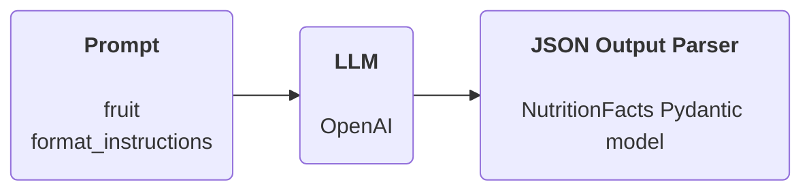

# langchain-output-parser

```mermaid
graph LR;
prompt(<b>Prompt</b>\n\nfruit\nformat_instructions) 
prompt --> llm(<b>LLM</b>\n\nOpenAI) 
llm --> output_parser(<b>JSON Output Parser</b>\n\nNutritionFacts Pydantic model);
```

### Notebook
[output-parser-openai.ipynb](output-parser-openai.ipynb)

[output-parser-databricks.ipynb](output-parser-databricks.ipynb)